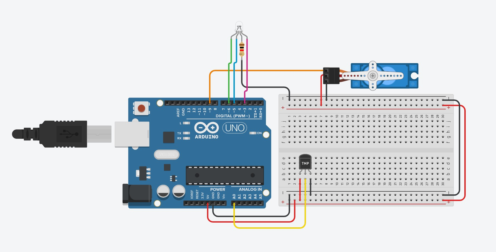

# Arduino Smart Temperature Control System

# Overview
This project demonstrates how to use an Arduino Uno to control an RGB LED and a servo motor based on temperature readings from a TMP36 temperature sensor. The system dynamically changes the color of the RGB LED and adjusts the servo motor angle based on the detected temperature.

#Functionality
- The RGB LED changes color based on a predefined temperature range.
- The servo motor maps its movement within a set angle range according to the temperature.
- The TMP36 temperature sensor provides real-time temperature readings, influencing both the LED color and servo position.

# Components 
- Arduino Uno – The microcontroller board used to process sensor data and control the components.
- TMP36 Temperature Sensor – Analog temperature sensor that outputs a voltage corresponding to the ambient temperature.
- RGB LED (4-leg) – Displays different colors based on the temperature range.
- 1kΩ Resistor – Used to limit current and protect the LED.
- 3-Pin Servo Motor – Adjusts its position based on temperature variations.

# Circuit Diagram 


# How It Works
1. The TMP36 sensor reads the ambient temperature.
2. The Arduino processes the sensor's analog output and converts it to a temperature value.
3. The RGB LED changes its color based on specific temperature thresholds.
4. The servo motor adjusts its angle based on the temperature, mimicking a gauge-like behavior.

# Temperature Table
                    
Temperature Range  | Colour
------------- | -------------
-40 <= Temp <= -10  | Blue
-10 <= Temp <= 20   |  Green
20 <= Temp <= 50    | Yellow
50 <= Temp <= 80  | Purple
80 <= Temp <= 110  | Red
110 <= Temp <= 125  | White

# Code 

Before the setup(), variables were created to store the target sensor input, temperature in degrees as well as the maximum temperature.

```C++
#include <Servo.h>

Servo servo_9;
//The variable we will use to store the sensor input
int sensorInput = 0;
//The variable we will use to store temperature in degrees
int tempDeg = 0; 
//The variable we will use to store the max temperture 
int maxTemp = 0;
```
Inside the setup, pins are configured using the pinMode() function. Pin A0 is set as an input, so to capture the electrical state of the temperature sensor. Pins 3, 5, and 6 are configured as outputs to control the LEDs. Pin 9 is configured to control the servo motor.

```C++
void setup() {
  	pinMode(A0, INPUT);
	//Start the Serial Port at 9600 baud (default)
	Serial.begin(9600);
	pinMode(LED_BUILTIN, OUTPUT);
    pinMode(3, OUTPUT);
  	pinMode(5, OUTPUT);
  	pinMode(6, OUTPUT);
  	servo_9.attach(9, 500, 2500);
}
```
In the main loop, sensor input is set to -40 degrees celsius and maximum temperture is 125 degrees celsius.

```C++
void loop() {
   sensorInput = -40;
   maxTemp = 125;
   
   //read the analog sensor and store it
   tempDeg = map(((analogRead(A0) - 20) * 3.04), 0, 1023, -40, 125);
    
```
The loop's seven if statements account for different segments of a certain temperature range between -40 and 125 degrees C. It changes colors as the temperature varies.
```C++
  if(tempDeg<sensorInput){
    digitalWrite(3, LOW);
    digitalWrite(5, LOW);
    digitalWrite(6, LOW);
  }
  
  if(tempDeg >= sensorInput && tempDeg <= sensorInput + 30){
    digitalWrite(LED_BUILTIN, HIGH);
  	analogWrite(3, 0);
  	analogWrite(6, 0);
  	analogWrite(5, 255);
  	delay(1000); // Wait for 1000 millisecond(s)
  	digitalWrite(LED_BUILTIN, LOW);
  	delay(1000); // Wait for 1000 millisecond(s)
	}
  
  if(tempDeg >= sensorInput + 30 && tempDeg <= sensorInput + 60){
    digitalWrite(LED_BUILTIN, HIGH);
  	analogWrite(3, 0);
  	analogWrite(6, 255);
  	analogWrite(5, 0);
  	delay(1000); // Wait for 1000 millisecond(s)
  	digitalWrite(LED_BUILTIN, LOW);
  	delay(1000); // Wait for 1000 millisecond(s)
	}
   
  if(tempDeg >= sensorInput + 60 && tempDeg <= sensorInput + 90){
    digitalWrite(LED_BUILTIN, HIGH);
  	analogWrite(3, 255);
  	analogWrite(6, 255);
  	analogWrite(5, 0);
  	delay(1000); // Wait for 1000 millisecond(s)
  	digitalWrite(LED_BUILTIN, LOW);
  	delay(1000); // Wait for 1000 millisecond(s)
	}
   
  if(tempDeg >= sensorInput + 90 && tempDeg <= sensorInput + 120){
    digitalWrite(LED_BUILTIN, HIGH);
  	analogWrite(3, 120);
  	analogWrite(6, 81);
  	analogWrite(5, 169);
  	delay(1000); // Wait for 1000 millisecond(s)
  	digitalWrite(LED_BUILTIN, LOW);
  	delay(1000); // Wait for 1000 millisecond(s)
	}
  
  if(tempDeg >= sensorInput + 120 && tempDeg <= sensorInput + 150){
    digitalWrite(LED_BUILTIN, HIGH);
  	analogWrite(3, 255);
  	analogWrite(6, 0);
  	analogWrite(5, 0);
  	delay(1000); // Wait for 1000 millisecond(s)
  	digitalWrite(LED_BUILTIN, LOW);
  	delay(1000); // Wait for 1000 millisecond(s)
	}
  
  if(tempDeg >= sensorInput + 150 && tempDeg <= sensorInput + 165){
    digitalWrite(LED_BUILTIN, HIGH);
  	analogWrite(3, 255);
  	analogWrite(6, 255);
  	analogWrite(5, 255);
  	delay(1000); // Wait for 1000 millisecond(s)
  	digitalWrite(LED_BUILTIN, LOW);
  	delay(1000); // Wait for 1000 millisecond(s)
	}
```
The loop's last two if statements account for the action of the servo motor. The angle of the motor changes as the temperature reaches the maximum and the minimum.

```C++
  if(tempDeg == sensorInput){
    servo_9.write(0);  // tell servo to go to a particular angle
  	delay(1000);
  }
  if (tempDeg == maxTemp) {
    servo_9.write(180);  // tell servo to go to a particular angle
  	delay(1000);
  } 
} 
```


 

